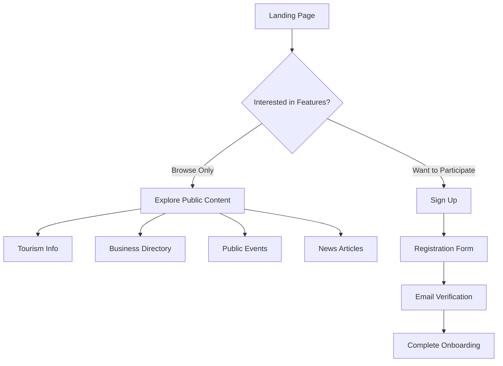
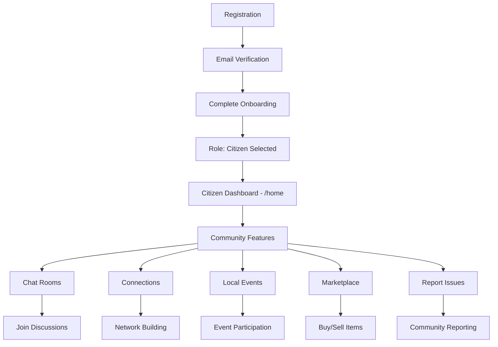
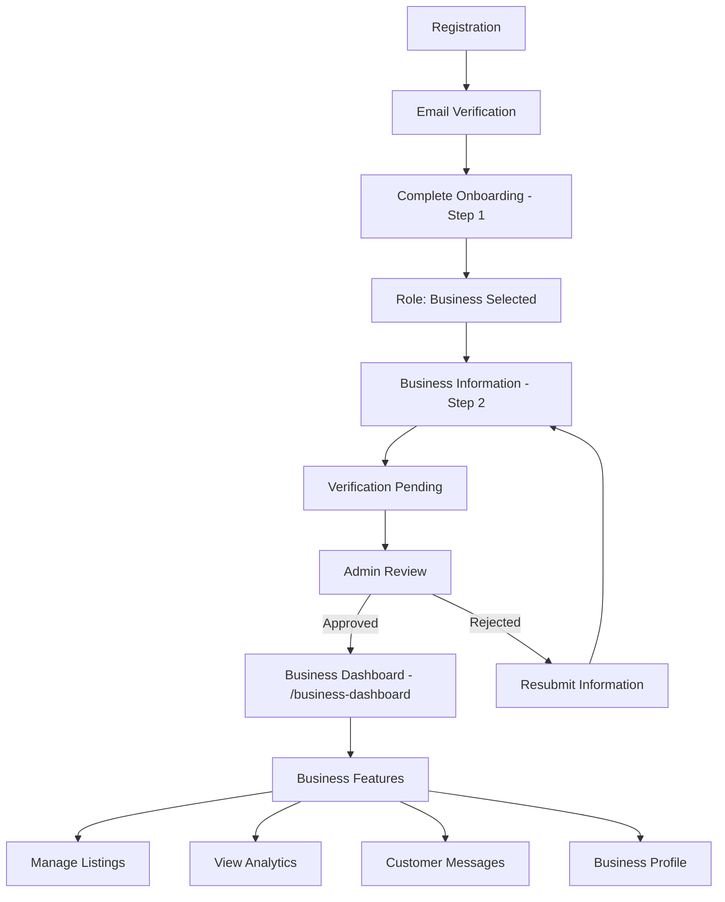
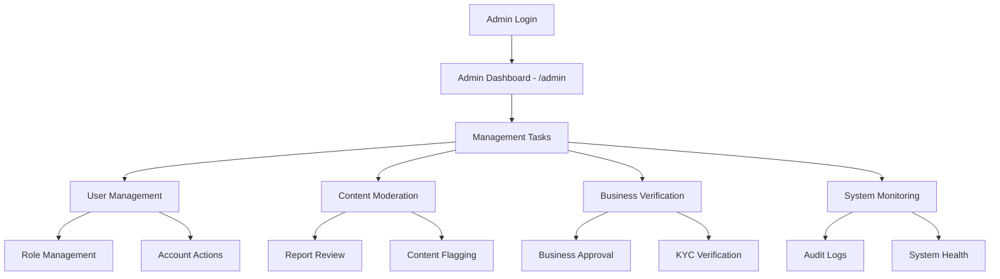

# User Flows Guide - Limpopo Connect

## Overview

This guide documents the complete user flows for each role type in Limpopo Connect, detailing the journey from registration through role-specific features. Each role has distinct capabilities, access levels, and user experiences designed for their specific needs.

**Last Updated:** October 10, 2025  
**Version:** 1.0 - Role-Based Experience Integration

---

## Role Types and Purposes

### 1. **Visitor** 🌍
- **Purpose**: Explore Limpopo without an account
- **Default Landing**: `/explore`
- **Access Level**: Public content only
- **Key Features**: Tourism info, events, business directory (view-only)

### 2. **Citizen** 👥  
- **Purpose**: Limpopo residents with full social features
- **Default Landing**: `/home`
- **Access Level**: Community participation and content creation
- **Key Features**: Social feed, chat rooms, connections, marketplace

### 3. **Business** 🏢
- **Purpose**: Business owners managing their presence
- **Default Landing**: `/business-dashboard`
- **Access Level**: Business listing management + citizen features
- **Key Features**: Business analytics, listing management, lead generation

### 4. **Admin** 🛡️
- **Purpose**: Platform administrators and moderators
- **Default Landing**: `/admin`
- **Access Level**: Full platform access and management
- **Key Features**: User management, content moderation, system monitoring

---

## Complete User Flows

### Visitor Flow



**Visitor Journey Steps:**

1. **Landing** - `/` or `/explore`
   - Browse public content without authentication
   - See limited navigation (Home, Explore, Tourism, Events, Business Directory)
   - Clear CTA buttons to "Sign Up" and "Sign In"

2. **Exploration** - Public routes only
   - **Tourism**: View attractions, activities, cultural sites
   - **Events**: See upcoming public events and activities
   - **Business Directory**: Browse local businesses (view-only)
   - **News**: Read community updates and announcements

3. **Sign Up Trigger** - When visitor wants to:
   - Join chat rooms
   - Connect with locals
   - Create marketplace listings
   - Participate in community discussions

4. **Registration** - `/auth/register`
   - Basic information collection
   - Role selection prompt (Citizen vs Business)
   - Terms and privacy policy acceptance

### Citizen Flow



**Citizen Journey Steps:**

1. **Onboarding** - `/complete-onboarding`
   - Personal information (name, phone)
   - Role confirmation: "Citizen"
   - Profile photo upload (optional)
   - Location/area selection

2. **Dashboard** - `/home`
   - **Quick Stats**: Connections (24), Chat Rooms (8), Reports (5), Events (3)
   - **Quick Actions**: 
     - Create Report (community issues)
     - Join Chat Room (local discussions)
     - Find Connections (networking)
     - Explore Area (local discovery)

3. **Core Features**:
   - **Chat Rooms** (`/chat-demo`): Join community discussions by area/interest
   - **Connections** (`/connections`): Build local network, find like-minded people
   - **Marketplace** (`/marketplace`): Buy/sell items, local commerce
   - **Events** (`/events`): RSVP to events, create community gatherings
   - **Reports** (`/reports`): Report local issues, track resolution status

4. **UI Elements**:
   - Role badge: Blue "Citizen" badge in header
   - Quick links dropdown: Home Feed, Chat Rooms, My Connections, Marketplace
   - Sidebar widgets: Local weather, load shedding info, emergency contacts

### Business Flow



**Business Journey Steps:**

1. **Onboarding Part 1** - Basic info
   - Personal information (owner details)
   - Role selection: "Business"

2. **Onboarding Part 2** - Business details
   - **Required**: Business name, contact email
   - **Optional**: Registration number, phone, address, description
   - **Verification**: Documents upload, business validation
   - **Status**: Pending admin approval

3. **Approval Process**:
   - **Pending**: Limited access, can view but not manage listings
   - **Approved**: Full business features unlocked
   - **Rejected**: Feedback provided, can resubmit

4. **Business Dashboard** - `/business-dashboard`
   - **Performance Stats**: Views (1,247), Inquiries (23), Rating (4.8), Listings (3)
   - **Quick Actions**:
     - Create New Listing
     - View Analytics
     - Manage Listings  
     - Customer Messages

5. **Business Features**:
   - **Listings** (`/listings`): Create, edit, manage business listings
   - **Analytics** (`/business-analytics`): Performance insights, customer data
   - **Messages**: Respond to customer inquiries and reviews
   - **Profile**: Manage business information and verification status

6. **UI Elements**:
   - Role badge: Orange "Business" badge in header
   - Quick links: Business Dashboard, Manage Listings, Analytics, Messages
   - Verification indicator: Shows pending/approved status

### Admin Flow



**Admin Journey Steps:**

1. **Admin Dashboard** - `/admin`
   - **System Stats**: Total Users (2,847), Pending Reports (12), Business Apps (8), System Health (98%)
   - **Quick Actions**:
     - User Management (2,847 users)
     - Content Moderation (4 flagged items)
     - Business Verification (8 pending)
     - Analytics, Audit Logs, Settings

2. **Core Admin Functions**:
   - **User Management** (`/admin/users`): 
     - View all users, roles, activity
     - Update roles, suspend accounts
     - Role audit trail tracking
   
   - **Content Moderation** (`/admin/content`):
     - Review flagged posts/comments
     - Handle community reports
     - Content removal and warnings
   
   - **Business Verification** (`/admin/businesses`):
     - Review business applications
     - Approve/reject with feedback
     - KYC document verification
   
   - **System Monitoring**:
     - Audit logs viewing
     - System health dashboard
     - Performance metrics

3. **UI Elements**:
   - Role badge: Red "Admin" badge in header
   - Quick links: Admin Panel, User Management, Content Moderation, Analytics
   - System status indicators: Green/yellow/red status dots
   - Priority badges on pending items (high/medium/low)

---

## Route Access Matrix

| Route | Visitor | Citizen | Business | Admin |
|-------|---------|---------|----------|-------|
| `/` | ✅ | ✅ | ✅ | ✅ |
| `/explore` | ✅ | ✅ | ✅ | ✅ |
| `/tourism` | ✅ | ✅ | ✅ | ✅ |
| `/events` | ✅ | ✅ | ✅ | ✅ |
| `/business-directory` | ✅ | ✅ | ✅ | ✅ |
| `/news` | ✅ | ✅ | ✅ | ✅ |
| `/auth/login` | ✅ | ✅ | ✅ | ✅ |
| `/auth/register` | ✅ | ✅ | ✅ | ✅ |
| `/home` | ❌ | ✅ | ✅ | ✅ |
| `/profile` | ❌ | ✅ | ✅ | ✅ |
| `/connections` | ❌ | ✅ | ✅ | ✅ |
| `/chat-demo` | ❌ | ✅ | ✅ | ✅ |
| `/marketplace` | ❌ | ✅ | ✅ | ✅ |
| `/business-dashboard` | ❌ | ❌ | ✅ | ✅ |
| `/listings` | ❌ | ❌ | ✅ | ✅ |
| `/business-analytics` | ❌ | ❌ | ✅ | ✅ |
| `/admin` | ❌ | ❌ | ❌ | ✅ |
| `/admin/*` | ❌ | ❌ | ❌ | ✅ |

---

## Permission Matrix

| Permission | Visitor | Citizen | Business | Admin |
|------------|---------|---------|----------|-------|
| View Public Content | ✅ | ✅ | ✅ | ✅ |
| Create Posts | ❌ | ✅ | ✅ | ✅ |
| Join Chat Rooms | ❌ | ✅ | ✅ | ✅ |
| Send Messages | ❌ | ✅ | ✅ | ✅ |
| Create Reports | ❌ | ✅ | ✅ | ✅ |
| Contact Businesses | ❌ | ✅ | ✅ | ✅ |
| Manage Business Listings | ❌ | ❌ | ✅ | ✅ |
| View Business Analytics | ❌ | ❌ | ✅ | ✅ |
| Moderate Content | ❌ | ❌ | ❌ | ✅ |
| Manage Users | ❌ | ❌ | ❌ | ✅ |
| Access Admin Panel | ❌ | ❌ | ❌ | ✅ |
| View Audit Logs | ❌ | ❌ | ❌ | ✅ |

---

## UI/UX Expectations per Role

### Visual Role Indicators

**Header Badge Colors:**
- Visitor: Gray badge with Eye icon
- Citizen: Blue badge with User icon  
- Business: Orange badge with Store icon
- Admin: Red badge with Shield icon

**Dashboard Themes:**
- **Citizen**: Community-focused (blue accents, social icons)
- **Business**: Professional (orange accents, analytics focus)
- **Admin**: System-focused (red accents, monitoring tools)

### Navigation Patterns

**Visitor Navigation:**
```
Home | Explore | Tourism | Events | Business Directory | News | [Sign In] [Register]
```

**Authenticated Navigation:**
```
Logo | [Role-based routes] | [Role Badge ▼] 
                              ├─ Dashboard
                              ├─ My Profile  
                              ├─ [Quick Actions...]
                              └─ Sign Out
```

**Mobile Navigation:**
- Collapsible hamburger menu
- Role badge shown prominently
- Quick actions grid (2x2) for mobile efficiency

---

## Database Expectations

### Row Level Security (RLS)

**Profiles Table:**
- **Own profile**: Full read/write access
- **Public profiles**: Read access for authenticated users
- **All profiles**: Admin full access
- **Private profiles**: No access for non-owners (except admin)

**Rooms & Messages:**
- **Room members**: Full access to room and messages
- **Public rooms**: Join access for authenticated users
- **Private rooms**: Invite-only access
- **Admin**: Full access to all rooms and messages

**Business Verification:**
- **Own records**: Business users can view/update own verification
- **All records**: Admin can view/manage all verifications
- **Other users**: No access to verification records

**Audit Logs:**
- **Own logs**: Users can view their own activity logs
- **Room logs**: Room owners can view room access logs  
- **All logs**: Admin can view all audit logs

### Role Escalation Rules

**Role Hierarchy:** `visitor < citizen < business < admin`

**Escalation Permissions:**
- Users can only update their own profiles
- Admin can update any user's role
- Role changes are logged in `role_audit_logs`
- Business role requires verification before full access

---

## Test Scenarios

### Authentication Tests

1. **Registration Flow**
   - Register as citizen → Complete onboarding → Redirect to `/home`
   - Register as business → Complete onboarding → Verification pending → Limited access

2. **Login Redirect**
   - Visitor login → Redirect to `/explore`
   - Citizen login → Redirect to `/home`
   - Business login → Redirect to `/business-dashboard`
   - Admin login → Redirect to `/admin`

3. **Role Access Control**
   - Citizen accessing `/admin` → Show access denied
   - Visitor accessing `/profile` → Redirect to login
   - Business accessing admin routes → Access denied

### Feature Tests

1. **Citizen Features**
   - Join chat room → Success
   - Create community report → Success
   - View marketplace → Success
   - Access business features → Denied

2. **Business Features**
   - Create business listing → Success (if verified)
   - View business analytics → Success
   - Access admin panel → Denied
   - Manage other businesses → Denied

3. **Admin Features**
   - View all users → Success
   - Moderate content → Success
   - Update user roles → Success with audit log
   - Access all features → Success

### Database Security Tests

1. **Profile Access**
   - User A viewing User B's private profile → Denied
   - Admin viewing any profile → Success
   - Public profile viewing → Success for authenticated

2. **Room Security**
   - Non-member accessing private room → Denied
   - Member accessing room messages → Success
   - Admin accessing any room → Success

3. **Business Data**
   - Business A viewing Business B's verification → Denied
   - Admin viewing all business verifications → Success
   - Citizen accessing business verification → Denied

---

## Error Handling & Edge Cases

### Authentication Errors
- **Invalid credentials**: Clear error message, password reset option
- **Unverified email**: Resend verification email option
- **Session expired**: Auto-redirect to login with return path

### Role Access Errors
- **Insufficient permissions**: Access denied page with:
  - Current role display
  - Required role(s) display
  - Request access button
  - Contact support link

### Business Verification Errors
- **Pending verification**: Dashboard shows limited features with status
- **Rejected application**: Clear feedback and resubmission flow
- **Missing documents**: Checklist of required items

### System Errors
- **Database unavailable**: Graceful degradation with cached data
- **API errors**: Retry mechanism with user feedback
- **Network issues**: Offline mode indicators

---

## Implementation Checklist

### Core Functionality ✅
- [x] Role ENUM in database with proper constraints
- [x] JWT claims mapping with role information
- [x] Route guards with `RequireRole` component
- [x] Role-based navigation and UI indicators
- [x] Onboarding flow with role selection
- [x] Role-specific dashboards and features

### Security ✅
- [x] RLS policies using JWT role claims (no `using(true)`)
- [x] Role escalation audit logging
- [x] Proper permission checking throughout app
- [x] Business verification workflow

### Testing ✅
- [x] Unit tests for auth provider and route guards
- [x] Integration tests for role-based flows
- [x] Database RLS policy tests
- [x] Smoke test script for role functionality

### Documentation ✅
- [x] User flows guide (this document)
- [x] Updated project documentation
- [x] Test scenarios and acceptance criteria
- [x] Deployment and rollback procedures

---

## Support & Troubleshooting

### Common Issues

**Issue**: User can't access expected routes after login
**Solution**: Check role assignment in database, verify JWT claims

**Issue**: Business features not working after approval
**Solution**: Check `business_verification.status = 'approved'`

**Issue**: Admin can't see all users/content
**Solution**: Verify admin role in database, check RLS policies

### Debugging Steps

1. **Check user role**: Query `profiles.role` for user ID
2. **Verify JWT claims**: Check browser session storage for role claims
3. **Test RLS policies**: Use SQL test scripts to verify permissions
4. **Check audit logs**: Review `role_audit_logs` for role changes

### Contact Information

- **Technical Issues**: Submit GitHub issue with role-based label
- **Security Concerns**: Contact security team immediately
- **Feature Requests**: Use feature request template with role context

---

**Document Version**: 1.0  
**Last Reviewed**: October 10, 2025  
**Next Review**: November 10, 2025